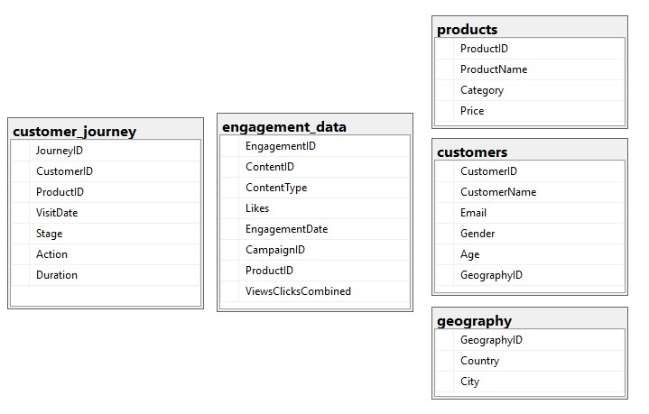
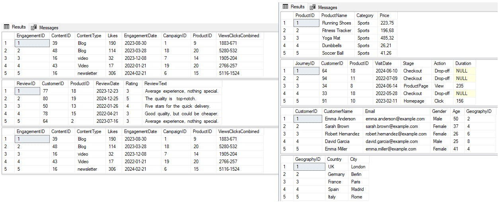
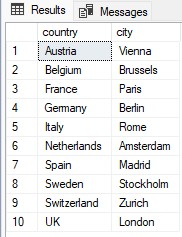
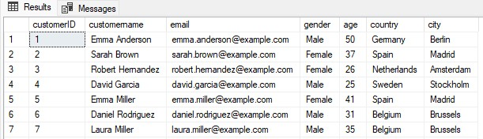
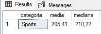
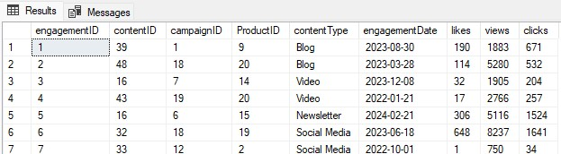

# Primeiro passo

Vamos entender os dados que nos foram fornecidos, retirando um Diagrama Entidade-Relacionamento do SQL Server temos:



E com isso vamos tirar uma amostra de cada tabela com limitador 5.

```
SELECT TOP 5 *
FROM engagement_data;

SELECT TOP 5 *
FROM customer_reviews;

SELECT TOP 5 *
FROM engagement_data;

SELECT TOP 5 *
FROM products;

SELECT TOP 5 *
FROM customer_journey;

SELECT TOP 5 *
FROM customers;

SELECT TOP 5 *
FROM geography
```



## Entendendo cada uma delas

Vamos entender e tirar algumas métricas delas no próprio SQL Server e tomamos nota para ajudarmos a lembrar desses pontos importantes durante a parte da criação do Dashboard.

Como temos o país e a cidade não vou utilizar o DISTINCT para vermos quantas cidades temos, direto acho melhor agrupar por país.

```
SELECT country, city
FROM geography
GROUP BY country, city
```



Nossos consumidores são de 10 cidades espelhados em 10 países.

```
SELECT COUNT(CustomerID)
FROM customers

SELECT AVG(age)
FROM customers

SELECT gender, COUNT(gender)
FROM customers
GROUP BY gender
```

E temos um total de 100 consumidores que fecharam alguma compra com a empresa. Com média de idade de 41 anos. Em um total de 54 mulheres e 46 homens.

Vou unir a tabela _geography_ com a _customers_, não vai fazer muito sentido deixar elas separadas no Power BI, e nosso data model fica mais enxuto.

```
SELECT customername,
		email,
		gender,
		age,
		country,
		city
FROM customers AS c
LEFT JOIN geography AS g
ON c.GeographyID = g.GeographyID;
```

Ficamos assim com a tabela customers desse jeito:



Essa primeira tabela está Ok e vou exporta-la dessa maneira com o nome de DimCustomers.

Na tabela _customer_reviews_ a única mudança feita foi arrumar os espaços duplos na parte de Texto das avaliações, o seguinte comando foi usado e a tabela exportada com o nome de _FactCustomerReviews_

```
SELECT reviewID,
		customerID,
		productID,
		reviewDate,
		rating,
		REPLACE(reviewText, '  ', ' ')
FROM customer_reviews
```

Tabela _customer_journey_ alguns valores na coluna _duration_ estão como NULL, vamos substituir NULL pela com a média de duração que temos do restante dos clientes e exportada como _FactCustomerJourney_

```
WITH cte AS (
SELECT ROUND(AVG(duration),0) AS avg_duration
FROM customer_journey
)
SELECT
		journeyID,
		customerID,
		productID,
		visitDate,
		stage,
		action,
		COALESCE(duration, sub.avg_duration) AS duration
FROM customer_journey
CROSS JOIN cte AS sub
```

Já na tabela _products_ tirei algumas informações que de inicio gostaria de observar, tirei a mediana e média do preço e ver quantas categorias distintas eles trabalham.

```
SELECT DISTINCT
	category AS categoria,
    (SELECT ROUND(AVG(price),2) FROM products) AS media,
	ROUND(PERCENTILE_CONT(0.5) WITHIN GROUP (ORDER BY price) OVER (),2) AS mediana
FROM products;
```



Além disso vamos criar faixas de preço para caso precisemos dar uma ideia para a empresa de quais níveis estão tendo performance altas e quais estão com performance baixas.

```
SELECT productID,
		productName,
		Category,
		Price,
		CASE WHEN price <= 100 THEN 'Baixo'
		WHEN price BETWEEN 100 AND 200 THEN 'Médio'
		ELSE 'Alto' END AS faixas_precos
FROM products
```

Produtos abaixo ou igual a 100 ficam na faixa 'Baixo' produtos entre 100 e 200 na faixa 'Médio' e acima disso 'Alto' sendo assim a tabela foi exportado com o nome _DimProducts_

Na tabela _engagement_data_ as mudanças foram a correção da padronização do texto na coluna _contentType_ pois alguns valores estavam sem espaços e todos maiusculas etc. E a coluna _viewClicksCombined_ estão com o número de visualizações e clicks juntos separados por -, o que fica fácil para nós separarmos em suas devidas colunas para melhor entendimento e análises futuras.

```
SELECT engagementID,
		contentID,
		campaignID,
		ProductID,
		CASE WHEN contentType LIKE 'SOCIALMEDIA' THEN 'Social Media'
		ELSE UPPER(LEFT(contentType, 1)) + LOWER(SUBSTRING(contentType, 2, LEN(contentType))) END AS contentType,
		engagementDate,
		likes,
		LEFT(viewsClicksCombined, CHARINDEX('-', viewsClicksCombined) -1) AS views,
		RIGHT(viewsClicksCombined, LEN(viewsClicksCombined) - CHARINDEX('-', viewsClicksCombined)) AS clicks
FROM engagement_data
```



Assim exportando ela como _FactEngagementData_

Feito isso finalizamos a parte do SQL que envolveu extrair e tratar de imediato algumas questões de erros e formatações. Próxima etapa será finalizada no Power BI.

[Voltar ao README.md](/powerbi_analise_marketing/README.md)
